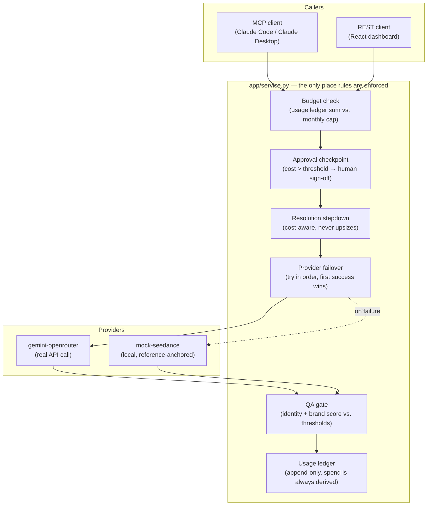

# MediaOps Agent

A generative-media production pipeline with the business rules — budget
limits, approval checkpoints, usage metering, provider failover, QA gates —
enforced in the service layer itself, not left to an agent's good judgment.
Reachable from an MCP server (Claude Code / Claude Desktop), a REST API, and
a React dashboard, all three backed by the same code path.

Built to exercise a specific shape of problem: an agent that requests media
generation on behalf of a client campaign should never be able to talk its
way past a budget cap by retrying, never auto-spend above a threshold
without a human in the loop, and never have its own QA self-report trusted.

## Why this exists

Most agent demos show an LLM calling a tool. The harder, more commercially
relevant problem is what happens *around* that call: who's paying, is this
spend allowed, does the output actually look like the reference character,
and what happens when the primary provider is down. This project is that
harness — a compact model of an agency running paid client media generation,
where the agent is one caller among several and gets no special treatment.

## Architecture



## Design decisions

**1. One service layer, two surfaces.** `app/service.py` is imported by
both `app/main.py` (FastAPI) and `mcp_server.py` (MCP). An agent calling the
MCP tool has exactly the same limits as a REST client — the guardrails
can't be routed around by picking a different door in.

**2. Spend is a derived value, never a counter.** `UsageLedgerEntry` rows
are append-only; a client's spend is always `sum(ledger where month=this
month)`, computed fresh on every check (`service.get_client_usage_cents`).
There's no mutable `usage_cents` field that could drift from the audit
trail — the ledger *is* the balance.

**3. The approval threshold is evaluated against a stable reference cost.**
Whether a job needs human sign-off is decided from the primary provider's
price for the *requested* resolution, before failover runs — not from
whatever the job ends up actually costing. Otherwise a job could dodge
review just because the cheap fallback happened to serve it.

**4. QA doesn't trust the generator.** Identity-consistency and
brand-compliance scores are computed from the output pixels
(`app/qa.py` — average-hash Hamming distance against the reference;
average-colour distance against the brand palette), not asserted by the
provider. Swap `mock_seedance` for a real Seedance/Gemini call and the gate
doesn't change, because it was never trusting the provider's self-report.

**5. Cost-aware resolution stepdown, not outright failure.** If a job's
requested resolution doesn't fit the client's remaining budget but a
smaller one does, the service generates at the smaller size and records
that it did — see `_affordable_resolution` in `app/service.py`. It never
upsizes past what was requested.

## The hardest part

Getting the *ordering* of the four checks right. Budget, approval,
resolution, and failover all interact: approval has to be decided before
resolution stepdown runs (an expensive job shouldn't dodge review by
shrinking itself first), but the cheapest-possible-option check has to run
before *that* (no point asking a human to approve a job that can't be
afforded at any resolution). Get the order wrong and either an expensive
job slips through un-reviewed, or a job that would have fit gets rejected.
The tests in `backend/tests/test_service.py` exist specifically to pin that
ordering down — every one of them found a real bug in an earlier version of
`run_job` before it was fixed (see git history for the play-by-play: cost
scale vs. threshold miscalibration, resolution stepdown ignoring the
requested resolution).

The second hardest part, more of an open edge: the usage-ledger re-check
right before committing spend (`service.run_job`) is a best-effort guard
against two jobs racing past the same budget between the read and the
write — not a hard guarantee. A production deployment on Postgres would add
a `SELECT ... FOR UPDATE` on the client row at the top of the check; SQLite
(this project's zero-config default) doesn't support row locking the same
way, so that's called out rather than silently glossed over.

A third bug, found after the fact rather than by design: video jobs were
completely broken end-to-end. `_affordable_resolution` special-cases video
(it's priced flat, not by resolution — see `costs.py`) but returned the
literal string `"video"` instead of the actual requested frame size, and
that string gets passed straight to the provider as the WxH to render at.
Every video job failed on both providers (`gemini-openrouter: does not
support kind=video | mock-seedance: invalid resolution 'video'`) until it
was caught by actually running one end-to-end and reading the error,
not by re-reading the code. `test_video_job_generates_at_requested_frame_resolution`
now pins this down. Related hardening from the same pass: `create_job`
now validates `kind`/`resolution` against known values and confines
`reference_image_path` to inside the project directory — this API has no
auth, so an unvalidated server-side file path is an arbitrary local file
read, and an unvalidated resolution string is an unhandled `KeyError`
(a raw 500) instead of a clean 400.

## What's real vs. mocked

- **`gemini-openrouter`** (`app/providers/gemini_openrouter.py`) is a real
  HTTP call to OpenRouter's chat-completions endpoint with
  `modalities: ["image", "text"]`. It runs for real if `OPENROUTER_API_KEY`
  is set. Verify the model slug in `app/config.py` against
  [openrouter.ai/models](https://openrouter.ai/models) before relying on it
  — image-model catalogs move.
- **`mock-seedance`** (`app/providers/mock_seedance.py`) stands in for a
  second frontier provider (e.g. Seedance 2.0 via BytePlus) with no network
  call, so the whole pipeline runs offline. It's reference-anchored for
  real, not just for show: when a reference image is supplied, its actual
  pixels are composited into the output, which is what makes the
  identity-consistency QA score meaningful without a real character-
  consistency model underneath it.
- **Video** is rendered as a 3-keyframe contact sheet (a storyboard draft),
  not an actual video file — real video generation is out of scope for a
  provider this project doesn't have paid access to; the cost table and
  business-rule flow around it are otherwise identical to images.
- **Postgres row-locking** for the budget race — see above.

Swapping the mock for a real second provider is a one-file change
(`app/providers/`) plus a line in `PROVIDER_ORDER` (`app/costs.py`) — the
service layer doesn't know or care which provider actually generated a job.

## Project layout

```
backend/
  app/
    config.py       # env-driven settings, cost/threshold defaults
    models.py        # SQLAlchemy: Client, Job, ApprovalRequest, UsageLedgerEntry
    costs.py         # per-provider, per-resolution cost table
    providers/       # gemini_openrouter.py (real), mock_seedance.py (local)
    qa.py            # identity-consistency + brand-compliance scoring
    service.py       # the guardrails — budget, approval, failover, QA
    main.py          # FastAPI app (REST surface)
    seed.py          # demo clients + jobs walking every code path
  mcp_server.py       # MCP surface (FastMCP) — same service.py underneath
  tests/              # pytest — budget, approval, stepdown, failover, QA
frontend/
  src/                # React + Vite + TS dashboard
.claude/skills/
  generate-campaign/  # Claude Agent Skill: batch-generate a campaign via MCP
docker-compose.yml    # Postgres + backend, for a production-like local run
```

## Run it

Commands below assume you're starting from the repo root (`mediaops-agent/`)
each time — `cd backend` or `cd frontend` first, don't chain `cd`s across
blocks. Comments are on their own line, not trailing on a command: on zsh
(macOS's default shell) `#` only starts a comment at the start of a line
in interactive mode, so a trailing `# comment` gets fed to the command as
literal arguments.

### Backend

```bash
cd backend
python3 -m venv venv && source venv/bin/activate
pip install -r requirements.txt
```

`.env` is optional — the app runs end-to-end with no `OPENROUTER_API_KEY`,
the mock provider serves everything. If you do want the real provider:

```bash
cp .env.example .env
# then edit .env and set OPENROUTER_API_KEY — never put a real key in
# .env.example, that file is committed to git
```

```bash
python -m app.seed
uvicorn app.main:app --reload
```

`app.seed` creates two demo clients and five jobs covering every status.
The API is then at http://127.0.0.1:8000.

```bash
pytest tests/ -v
```

### Frontend

```bash
cd frontend
npm install
npm run dev
```

Opens at http://localhost:5173, proxying `/api` and `/outputs` to `:8000`.

### Docker (Postgres instead of SQLite)

```bash
docker compose up --build
```

This runs Postgres + the backend only (`:8000`) — run the frontend with
`npm run dev` against it as above. `frontend/Dockerfile` exists for static
hosting (e.g. Cloud Run) but isn't wired into `docker-compose.yml`: the
built static bundle calls `/api` same-origin, which needs a reverse proxy
in front of both containers to route to the backend — a small
nginx/Caddy config, deliberately left out here as out of scope for a
local dev compose file.

### As an MCP server

This repo already has a project-scoped `.mcp.json` (added via
`claude mcp add mediaops --scope project -- backend/venv/bin/python
backend/mcp_server.py`). Open Claude Code at the repo root and approve it
once (`claude` will prompt), and `generate_asset`, `get_usage`,
`list_pending_approvals`, `approve_job`, `reject_job`, and `list_jobs` are
available as tools. The `.claude/skills/generate-campaign/` skill drives
those tools through a full campaign batch — see that file for the
procedure (check budget first, generate serially so each check is
meaningful, stop and hand off to a human on `awaiting_approval` rather
than trying to route around it).

To run the server standalone, or against another MCP client:

```bash
cd backend && source venv/bin/activate
python mcp_server.py
# or inspect it: npx @modelcontextprotocol/inspector python mcp_server.py
```

## Tests

20 tests, all exercising `service.run_job`/`create_job` against a real
in-memory SQLite DB (no mocked ORM) plus the QA scoring functions
directly: budget-rejection, the approval checkpoint, approve/reject
transitions, resolution stepdown, usage-ledger accumulation, provider
failover (and total-failure), the identity/brand QA gate, video-job
generation (regression test for a real bug — see below), and input
validation (unknown kind/resolution, reference paths outside the allowed
directory or that don't exist).

```bash
cd backend && source venv/bin/activate && pytest tests/ -v
```
